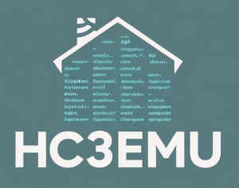

# HC3 QuickApp Emulator


## Overview

HC3Emu is a Lua-based emulator designed to simulate the Fibaro Home Center 3 QuickApp runtime environment. It allows developers to code and test QuickApps offline before deploying them to a physical HC3 controller.

Forum thread discussing the emulator (and questions) [here](https://forum.fibaro.com/topic/78728-quickapp-emulator-hc3emu/)

## Key Features

- Simulates most of the Fibaro SDK APIs
- Integrates with real HC3 controllers for testing
- Supports UI testing through proxy deployment
- Works with major Lua IDEs (Zerobrane, VSCode)
- Provides comprehensive debugging capabilities
- Supports file operations and state persistence
- Limited support for testing Scenes...

## Installation

```bash
# Install via LuaRocks
luarocks install hc3emu2

# Install specific version
luarocks install hc3emu2 <version>

# Update to latest version
luarocks install hc3emu2
```
There is an older version, named only 'hc3emu', that can also be installed but is nit supported anymore.


- For Windows installation see [here](https://forum.fibaro.com/topic/78728-quickapp-emulator-hc3emu/page/2/#findComment-290650)
- For Windows WSL installation see [here](https://forum.fibaro.com/topic/78728-quickapp-emulator-hc3emu/page/2/#findComment-290649)
- For MacOS, it's pretty straight forward to install Lua and Luarocks with brew.
- For Visual Studio Code setup see [here](https://forum.fibaro.com/topic/78728-quickapp-emulator-hc3emu/#findComment-290587)
- For ZeroBrane Studio setup see [here](https://forum.fibaro.com/topic/78728-quickapp-emulator-hc3emu/page/2/#findComment-290595)

## Dependencies

- Lua 5.3 or higher
- Required packages (installed automatically by LuaRocks):
   lua >= 5.3, <= 5.4
   copas >= 4.7.1-1
   luamqttt >= 1.0.2-1
   lua-json >= 1.0.0-1
   bit32 >= 5.3.5.1-1
   lua-websockets-bit32 >= 2.0.1-7
   timerwheel >= 1.0.2-1
   luafilesystem >= 1.8.0-1
   luasystem >=  0.6.2-1
   argparse >= 0.7.1-1
   datafile >= 0.10-1
   mobdebug >= 0.80-1
- System requirement: openssl

## Configuration

### Global Configuration

The emulator can be configured through:
1. Settings in the QA file, using --%%directive=value
2. `hc3emu.lua` in the project directory
3. `.hc3emu.lua` in the user's home directory. Put credentials here so they don't polute project directory.
4. Credentials can also be specified with environment variables or an .env file
Settings in QA files overrides project settings that overrides home directory settings.

### QuickApp Configuration

QuickApps are configured using special headers directives in comments starting with `--%%`\<name>=\<value>
User credentials, like HC3 user,url, and password should not be set here, but should be set in a configuration file or environment variabes/file.

```lua
--%%name=MyQuickApp               # Name of the QuickApp
--%%type=com.fibaro.binarySwitch  # Device type
--%%proxy=true                    # Create HC3 proxy (named MyQuickAppProxy)
--%%var=foo:config.secret         # Set QuickApp variable (from config file)
--%%debug=api:true                # Configure a debug flag
--%%file=lib.lua:lib              # Include external file
--%%save=MyQA.fqa                 # Save as FQA file when running
```

#### List of headers
- --%%type=\<type> - Type of the QA, 
ex. --%%type=com.fibaro.binarySwitch
- --%%name=\<name> - Name of the QA, 
ex. --%%name=My QuickApp
- --%%proxy=\<true|false> - Make this device a proxy device
- --%%proxy_new=\<true|false> - Recreate proxy if exists? Default false
- --%%proxy_set_ui=\<true|false> - Set UI for the proxy device at every startup? Default false
- --%%state=\<tag> - Tag for the state file, 
ex. --%%state=MyQAState
- --%%time=\<time> - Start time for the emulator, 
ex. --%%time=2027/10/10/12:00:00
- --%%speed=\<time> - Hours to speed the emulator, 
ex. --%%speed=24*7 -- speed for 1 week
- --%%offline=\<true|false> - Run in offline mode, 
ex. --%%offline=true
- --%%logui=\<true|false> - Log proxy's current UI at startup, 
ex. --%%logui=true
- --%%webui=\<true|false> - Enable emulated web UI for the QA, 
ex. --%%webui=true
- --%%uid=\<string> - uid property of the QA, 
ex. --%%uid=12345678-1234-5678-1234-567812345678
- --%%manufacturer=\<string> - Manufacturer property of the QA, 
ex. --%%manufacturer=MyCompany
- --%%model=\<string> - Model property of the QA, 
ex. --%%model=MyModel
- --%%role=\<string> - Device role of the QA, 
ex. --%%role=Light
- --%%description=\<string> - Description property of the QA, 
ex. --%%description=My QuickApp
- --%%latitude=\<number> - Latitude of the system, 
ex. --%%latitude=59.3293
- --%%longitude=\<number> - Longitude of the system, 
ex. --%%longitude=18.0686
- --%%temp=\<path> - Path to the temporary directory, 
ex. --%%temp=/tmp/hc3emu
- --%%nodebug=\<true|false> - Disable debugging, 
ex. --%%nodebug=true
- --%%norun=\<true|false> - Load but do not run the QuickApp, 
ex. --%%norun=true
- --%%silent=\<true|false> - Do not print debug messages, 
ex. --%%silent=true
- --%%breakOnLoad=\<true|false> - Break on first line when loading the QuickApp, 
ex. --%%breakOnLoad=true
- --%%breakOnInit=\<true|false> - Break on first line of QuickApp:onInit(), 
ex. --%%breakOnInit=true
- --%%save=\<path> - Save the QA as a .fqa when running, 
ex. --%%save=myQA.fqa
- --%%nodir=\<true|false> - Do not create emu directory, 
ex. --%%nodir=true
- --%%conceal=\<true|false> - Conceal quickApp variables when saving QA, 
ex. --%%conceal=password:"Set this to the password"
- --%%condensedLog=\<true|false> - Use condensed log format, 
ex. --%%condensedLog=true
- --%%pport=\<number> - Port for the proxy, 
ex. --%%pport=8265
- --%%wport=\<number> - Port for the web server, 
ex. --%%wport=8266
- --%%hport=\<number> - Port for the help server, 
ex. --%%hport=8267
- --%%dport=\<number> - Port for the debugger, 
ex. --%%dport=8172
- --%%hip=\<ip> - IP for the help server, 
ex. --%%hip=127.0.0.1
- --%%url=\<url> - URL for the HC3, 
ex. --%%url=http://192.168.1.57/
- --%%user=\<user> - User for the HC3, 
ex. --%%user=admin
- --%%pwd=\<password> - Password for the HC3, 
ex. --%%pwd=admin
- --%%pin=\<pin> - PIN for the HC3, 
ex. --%%pin=1234
- --%%u=\<table> - Add UI element to the QuickApp, 
ex. --%%u={button="btn1",text="Click me",onReleased="myFunction"}
- --%%debug=\<flags> - Set debug flags, 
ex. --%%debug=system:true,api:true,onAction:true
- --%%file=\<path,method> - Add file to the QuickApp, 
ex. --%%file=./myfile.lua,init
- --%%var=\<name:value> - Add variable to the QuickApp, 
ex. --%%var=MyVar:"MyValue"
- --%%install=\<user,pass,url> - Install the QuickApp on the HC3, 
ex. --%%install=admin,admin,http://192.168.1.57/

#### List of debug flags
  - system=\<boolean> --System debug (combined)
  - api=\<boolean> --Log API errors
  - device=\<boolean> --Device lifecycle debug
  - http=\<boolean> --log HTTP requests
  - timer=\<boolean> --Timer operations
  - time=\<boolean> --Time operations
  - onAction=\<boolean> --Log onAction calls
  - onUIEvent=\<boolean> --Log onUIEvent calls
  - notrace=\<boolean> --No trace log
  - rawrefresh=\<boolean> --Raw refresh log
  - refresh=\<boolean> --Refresh log
  - warn=\<boolean> --Warning log
  - server=\<boolean> --Server log
  - web=\<boolean> --Web server log

### Configuration files ~./hc3emu.lua and ./.hc3emu.lua
The file should be a lua file that returns a table.
```lua
return {
  user = "admin",
  password = "Admin",
  url = "http://192.168.1.157/",
  secret = "My secret value"
}
```
The secret field can then be accessed in the QA, like above...

### Environment variables
There are a credentials that can be set with environment variables
HC3USER = \<username>
HC3PASSWORD = \<password>
HC3URL = http://\<ip>
HC3PIN = \<pin>

These can also be specifed in an .env file in the working directory and will be picked up that way. This is because for some platforms it can be difficult to set environment variables to be seen by applications ex. MacOS)

## Setup

### VSCode
Add a launch option to .vscode/.launch.json, 
or add the launch option in your vscode User Settings to have the luanch option available in all projects
```json
    {
      "name": "hc3emu2: Current File",
      "type": "luaMobDebug",
      "request": "launch",
      "workingDirectory": "${workspaceFolder}",
      "sourceBasePath": "${workspaceFolder}",
      "listenPort": 8172,
      "stopOnEntry": false,
      "sourceEncoding": "UTF-8",
      "interpreter": "lua",
      "arguments": [
        "-e",
        "require('hc3emu2')",
        "run",
        "${relativeFile}"
      ],
      "env": {
        "HC3URL": "${config:hc3emu.url}",
        "HC3USER": "${config:hc3emu.user}",
        "HC3PASSWORD": "${config:hc3emu.password}"
      },
      "listenPublicly": true
    },
```
The file is available [here](https://raw.githubusercontent.com/jangabrielsson/hc3emu2/refs/heads/main/.vscode/launch.example)
In this example, we also set the environment variables using values from our User Settings file. Remove if you provide credentials differently.

### ZeroBrane Studio
Install the zerobrane package file from the repo [here](https://raw.githubusercontent.com/jangabrielsson/hc3emu2/refs/heads/main/tools/HC3EMUplugin.lua) into .~/zbstudio/packages/HC3EMUplugin.lua
The file is a Zerobrane studio package file that provides API completions for QuickApps and an interpreter option in the 
Project -> Interpreter -> Hc3Emu emulator
to run your QuickApp files.

## CLI

It is also possible to run the emulator with a provided QA file using the command line.
Ex.
```bash
>lua -e "require('hc3emu2')" run MyQA.lua
```

### Tasks in vsode

Located [here](https://raw.githubusercontent.com/jangabrielsson/hc3emu2/refs/heads/main/.vscode/tasks.example), is a tasks.json file that provides VSCode tasks integration with commands like:

- `downloadQA(id, path)`: Download QuickApp from HC3
- `uploadQA(fname)`: Upload QuickApp to HC3
- `updateFile(fname)`: Update single file in QuickApp

To use the updateFile command the workspace needs a `.project` file.
It's auto generated with the --%%project=<quickapp_id> directive that allows the command/task to push the file to the right QA on the HC3

```json
{
  "files": {
    "main": "main.lua",
    "lib": "lib.lua"
  },
  "id": "<quickapp_id>"
}
```

## API Support

- api.delete(...)
- api.get(...)
- api.post(...)
- api.put(...)
- fibaro.HC3EMU_VERSION
- fibaro.PASSWORD
- fibaro.URL
- fibaro.USER
- fibaro.__houseAlarm(...)
- fibaro.alarm(...)
- fibaro.alert(...)
- fibaro.call(...)
- fibaro.callGroupAction(...)
- fibaro.clearTimeout(...)
- fibaro.debug(...)
- fibaro.emitCustomEvent(...)
- fibaro.error(...)
- fibaro.get(...)
- fibaro.getDevicesID(...)
- fibaro.getGlobalVariable(...)
- fibaro.getHomeArmState(...)
- fibaro.getIds(...)
- fibaro.getName(...)
- fibaro.getPartition(...)
- fibaro.getPartitionArmState(...)
- fibaro.getPartitions(...)
- fibaro.getRoomID(...)
- fibaro.getRoomName(...)
- fibaro.getRoomNameByDeviceID(...)
- fibaro.getSectionID(...)
- fibaro.getType(...)
- fibaro.getValue(...)
- fibaro.hc3emu
- fibaro.isHomeBreached(...)
- fibaro.isPartitionBreached(...)
- fibaro.profile(...)
- fibaro.scene(...)
- fibaro.setGlobalVariable(...)
- fibaro.setTimeout(...)
- fibaro.sleep(...)
- fibaro.trace(...)
- fibaro.useAsyncHandler(...)
- fibaro.wakeUpDeadDevice(...)
- fibaro.warning(...)
- net.HTTPClient(...)
- net.TCPSocket(...)
- net.UDPSocket(...)
- plugin._dev
- plugin._quickApp
- plugin.createChildDevice(...)
- plugin.deleteDevice(...)
- plugin.getChildDevices(...)
- plugin.getDevice(...)
- plugin.getProperty(...)
- plugin.mainDeviceId
- plugin.restart(...)
- json.encode(expr)
- json.decode(str)
- setTimeout(fun,ms)
- clearTimeout(ref)
- setInterval(fun,ms)
- clearInterval(ref)
- class <name>(<parent>)
- property(...)
- class QuickAppBase()
- class QuickApp()
- class QuickAppChild
- hub = fibaro

### Core APIs
- `api.*` - HTTP API operations
- `fibaro.*` - Core Fibaro functions
- `net.*` - Network operations
- `plugin.*` - Plugin management
- `json.*` - JSON handling

### Common Operations
```lua
-- HTTP Operations
api.get("/devices")
api.post("/quickApp/", fqa)

-- Device Operations
fibaro.call(deviceId, "turnOn")
fibaro.getValue(deviceId, "value")

-- Timer Operations
setTimeout(callback, milliseconds)
setInterval(callback, milliseconds)

-- Storage Operations
self:setVariable("name", value)
self:getVariable("name")
```
etc etc.

## Debugging

The emulator provides various debug flags that can be enabled, listed in a section above.
The emulator uses the standard Lua debugger (mobdebug), supporting its features.
To test if running in the emulator (as opposed to on the HC3) one can test for the presence of fibaro.hc3emu
Ex.
```lua
if fibaro.hc3emu then
  print("Running in the emulator!")
end
```

## Best Practices

1. Use state persistence for development:
```lua
--%%state=<id>
```
Running in offline mode this will create a state file that will be used for storing device and resource states between runs.
For QAs that use the QA internalStorage api, it's recommended to turn this on.
When <id> is changed, a new tate db will be created at run.

2. Organize code in multiple files:
```lua
--%%file=utils.lua:utils
--%%file=api.lua:api
```
First is the path to the lua file, second is the name the file will have in the QA. THey will be packaged and included in the saved .fqa file. In the emulator it behaves more or less like a lua require(\<file>)
Usually the path is a workspace relative path, but it's possible to spcify installed lua modules with a '$' prefix.
Ex.
```lua
--%%file=$hc3emu.lib.eventlib,events
```
In this case it will fetch the file required by require('hc3emu.lib.eventlib')
Be aware that the code needs to be pure lua and compatible with the HC3, or there will be problems later when trying to upload the QA to the HC3...

3. Test UI interactions using proxy mode:
```lua
--%%proxy=true
```

## Common Issues

1. **Missing Credentials**: Ensure URL, USER, and PASSWORD are configured when not in offline mode. If the emulator fails calling the HC3 (unathorized), it will block further requests. This to prevent that the HC3 blocks to emulator IP due to too many failed login requests... Fix credentials, and restart the emulator.
2. **File Permissions**: Check write permissions for state and save files

## Contributing

See the [Contributing Guide](docs/CONTRIBUTING.md) for details on:
- Setting up development environment
- Coding standards
- Pull request process

## License

Released under MIT License. See [LICENSE](LICENSE) for details.

## Documentation

The following documentation is available in the `doc/` directory:

- [API Documentation](doc/API.md) - Complete reference of the HC3Emu2 API
- [Architecture Overview](doc/ARCHITECTURE.md) - System design and component interaction
- [Installation Guide](doc/INSTALL.md) - How to install and configure HC3Emu2
- [Development Guide](doc/DEVELOPMENT.md) - Guide for contributing to HC3Emu2
